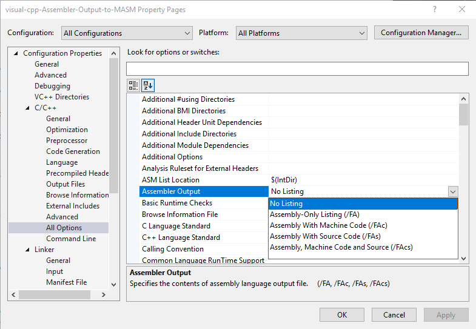
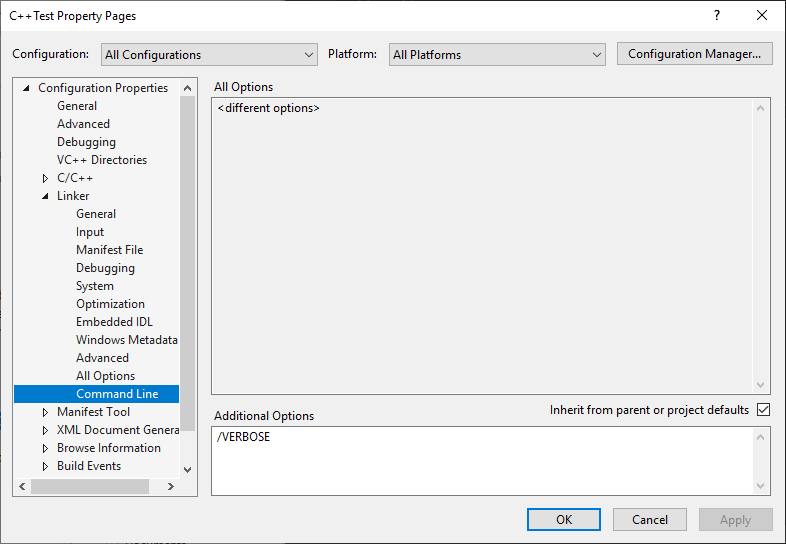

# visual-cpp-Assembler-Output-to-MASM
Convert VC++ Assembler Output to work with MASM <br>
Written by philip0000000 <br>
Find the project here [https://github.com/philip0000000/visual-cpp-Assembler-Output-to-MASM] <br>

## Information

When generating x86-64 assembly(Intel syntax) with Visual C++, with the option "Assembler Output". The assembler source file can not be used with MASM(ml64.exe). This project aims to parse the assembler source file and also link the correct static libraries, automatically, so it can be used by MASM.

The current project only works with one file and there exist a lot of things that need to be added. When using the -c flag, it only dose the minimum to work with MASM. The author of this program is working on adding more features.

The folder "example" contains 4 small C++ project. They allso include assembly code that was generated by visual C++. The file with number "2", has been parsed by this program(visual-cpp-Assembler-Output-to-MASM.exe) with the flag -c. There dose not exist a log file(file extension .log). Also the program in the folder "4-guess-number" has the output with the -l flag of the program.

## Usage

To get the the assembly output from visual C++ you need to set Assembler Output to something, e.g.: /FA



Then use the -c flag, the 1st argument is the name of the input assembly file, 2nd argument is the name of the generated assembly file that will be used by MASM.

```
visual-cpp-Assembler-Output-to-MASM.exe -c main.asm main2.asm
```

To compile with MASM, one needs the static library paths. They exist in a log file when using the /VERBOSE argument on the linker in the Visual C++ project.



Use the -l flag, with the 1st argument being the assembly file from the -c flag, 2nd argument is the log file from using the /VERBOSE option on the Visual C++ project, and the 3rd argument is the path to ml64.exe. E.g.:

```
visual-cpp-Assembler-Output-to-MASM.exe -l main2.asm main.log ml64.exe
```

## License

License under GNU GENERAL PUBLIC LICENSE Version 3, 29 June 2007
